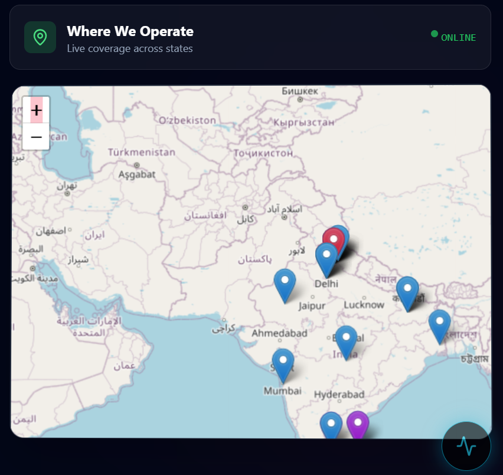

#  MediBridge

### Unified Health Referral & Rural Outreach Platform

MediBridge is a unified digital healthcare referral and rural outreach platform designed to connect **patients, doctors, rural clinics, and hospitals** through a centralized healthcare coordination system.

The platform focuses on simplifying patient registration, digital referrals, patient tracking, healthcare coordination, and AI-powered assistance. MediBridge aims to make healthcare services more **accessible, connected, and efficient**, particularly for communities where access to specialized healthcare and seamless referral systems can be challenging.

---

## 🎯 Problem Statement

Healthcare services in rural and semi-urban areas can often be disconnected across clinics, hospitals, doctors, and patients.

Patients may face difficulties with:

* Finding the appropriate healthcare facility
* Getting referred to the right doctor or hospital
* Tracking the progress of a referral
* Accessing healthcare information
* Communicating efficiently between different healthcare levels

MediBridge addresses these challenges by providing a **digital bridge between patients, healthcare workers, clinics, and hospitals.**

---

## 💡 Our Solution

MediBridge brings important healthcare workflows into one platform.

Instead of depending entirely on manual communication and disconnected processes, the platform provides a centralized environment for managing healthcare referrals, patient information, doctor interactions, healthcare facilities, and assistance.

### Core workflow

**Patient → Clinic → Referral → Doctor/Hospital → Treatment**

This creates a more organized and transparent healthcare journey.

---

## 🚀 Key Features

### 🏥 Patient Management

* Patient registration and profile management
* Organized patient information
* Digital healthcare workflow
* Easier access to relevant healthcare information

### 🔄 Digital Referral System

* Create and manage healthcare referrals
* Connect patients with appropriate healthcare professionals
* Track referral progress
* Reduce dependency on manual referral processes

### 👨‍⚕️ Doctor Portal

* Doctor-focused dashboard
* Patient and referral information
* Healthcare workflow management
* Improved communication between healthcare stakeholders

### 🏘️ Rural Healthcare Outreach

MediBridge is designed with rural and semi-urban healthcare accessibility in mind, helping connect smaller healthcare facilities with larger hospitals and specialists.

### 📍 Healthcare Facility Discovery

* Locate relevant healthcare facilities
* Interactive map-based interface
* Improve visibility of available healthcare services

### 🤖 AI-Powered Assistance

MediBridge integrates AI-assisted functionality to help users access healthcare-related information and navigate the platform more efficiently.

### 📊 Dashboard & Analytics

* Organized healthcare information
* Dashboard-based monitoring
* Referral and patient insights
* Easier management of healthcare workflows

### 📱 Responsive Interface

The platform is designed to provide a clean and accessible experience across different screen sizes.

---

## 🖼️ Project Screenshots

### 🏠 MediBridge Interface


### 👨‍⚕️ Doctor Dashboard


### 🏥 Healthcare Dashboard


### 📍 Healthcare Map



---

## 🏗️ System Architecture

MediBridge follows a modular architecture designed to separate the user interface, application logic, data management, and supporting services.

```text
                    ┌─────────────────────┐
                    │       Users         │
                    │ Patients / Doctors  │
                    │ Clinics / Hospitals │
                    └──────────┬──────────┘
                               │
                               ▼
                    ┌─────────────────────┐
                    │   MediBridge UI     │
                    │   Web Application   │
                    └──────────┬──────────┘
                               │
                               ▼
                    ┌─────────────────────┐
                    │ Application / API   │
                    │      Layer          │
                    └──────────┬──────────┘
                               │
                ┌──────────────┼──────────────┐
                ▼              ▼              ▼
          ┌──────────┐   ┌──────────┐   ┌──────────┐
          │ Patient  │   │ Referral │   │  Doctor  │
          │  Data    │   │  System  │   │  Data    │
          └──────────┘   └──────────┘   └──────────┘
                               │
                               ▼
                    ┌─────────────────────┐
                    │ AI / Support Tools  │
                    └─────────────────────┘
```

For a more detailed explanation, see [`architecture.md`](architecture.md).

---

## 🛠️ Technology Stack

| Category        | Technologies                         |
| --------------- | ------------------------------------ |
| Frontend        | HTML, CSS, JavaScript / React        |
| Backend         | Node.js / API services               |
| Database        | Project database layer               |
| Authentication  | User authentication & authorization  |
| Maps            | Interactive map integration          |
| AI              | AI-assisted healthcare functionality |
| Version Control | Git & GitHub                         |
| Deployment      | Vercel                               |

> The exact technologies used may evolve as the project continues to develop.

---

## 👨‍💻 My Contribution

I contributed to **MediBridge as a member of Team Grey Hats**, working on the project's development, documentation, testing, and overall presentation.

My contribution includes work related to:

* Frontend implementation
* UI/UX development
* Healthcare workflow documentation
* Feature integration
* Project testing
* GitHub repository organization
* Technical documentation
* Project presentation

For more details, see [`contribution.md`](contribution.md).

---

## 📚 Project Documentation

| Document                                     | Description                                        |
| -------------------------------------------- | -------------------------------------------------- |
| [`project-overview.md`](project-overview.md) | Project background, objectives, and overall vision |
| [`features.md`](features.md)                 | Detailed explanation of platform features          |
| [`architecture.md`](architecture.md)         | System architecture and technical structure        |
| [`contribution.md`](contribution.md)         | My contribution to the project                     |

---

## 🌍 Vision

The long-term vision of MediBridge is to build a connected healthcare ecosystem where patients can access the right healthcare services more easily and healthcare providers can coordinate referrals more efficiently.

The platform aims to help reduce communication gaps between:

**Rural Clinics ↔ Hospitals ↔ Doctors ↔ Patients**

---

## 🔮 Future Improvements

Potential future improvements include:

* 📱 Dedicated mobile application
* 🧠 More advanced AI-assisted healthcare features
* 📈 Advanced healthcare analytics
* 🔔 Real-time referral notifications
* 🌐 Improved rural connectivity support
* 🏥 Integration with additional healthcare facilities
* 🔐 Enhanced security and privacy controls
* 🌍 Expansion to larger healthcare networks

---

## 👥 Team

### Team Grey Hats

MediBridge was developed as a collaborative project by **Team Grey Hats**.

The project combines frontend development, backend engineering, healthcare workflow design, AI-assisted functionality, and documentation to create a unified healthcare referral solution.

---

## 🚀 Project Status

**Status:** 🚧 Active Development

MediBridge is continuously being improved as new features, refinements, and technical improvements are introduced.

---

## ⭐ Support

If you find the project interesting, consider giving the repository a ⭐ and exploring the project documentation.

**MediBridge — Connecting Healthcare, One Referral at a Time.**
