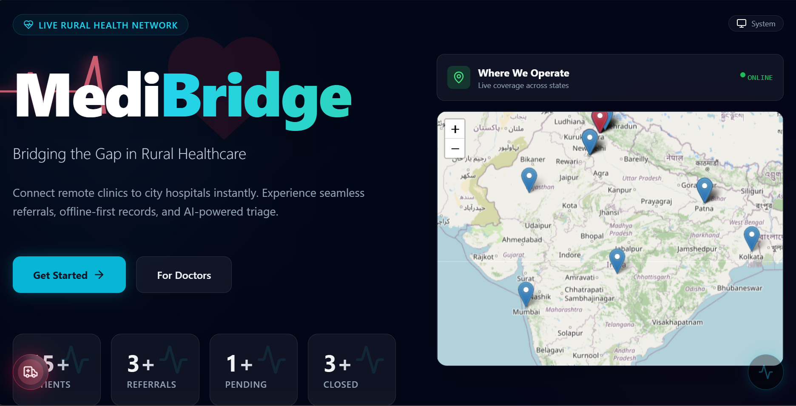
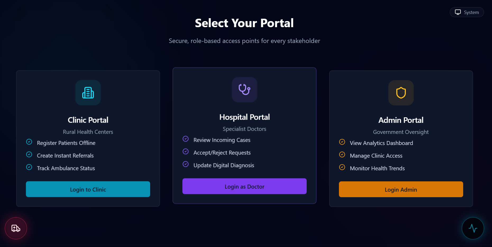
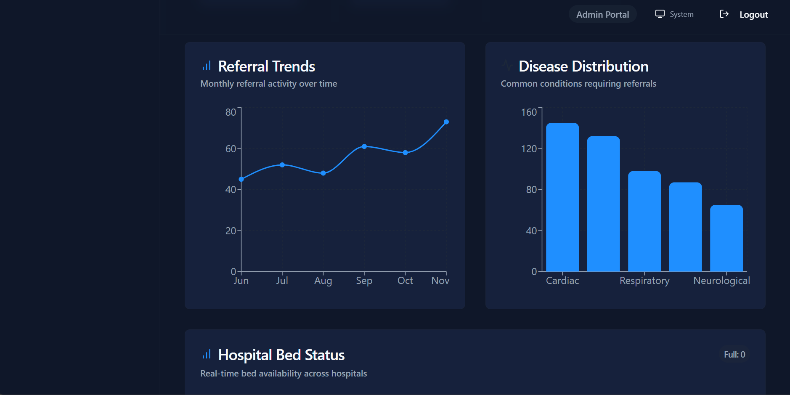

# 🌉 MediBridge Connect

### Unified Health Referral & Rural Outreach Platform

MediBridge Connect is a digital healthcare referral platform designed
to connect rural clinics, hospitals, doctors, and administrative teams
through a unified system.

---

## 🎯 Problem

Healthcare referrals can become difficult to manage when patient,
doctor, clinic, and hospital information is spread across different
systems.

MediBridge aims to provide a centralized platform for managing
healthcare referrals, discovering nearby healthcare facilities, and
improving coordination between healthcare stakeholders.

---

## 🚀 Key Features

### 👨‍⚕️ Multi-Portal System

- Clinic Portal
- Doctor Portal
- Admin Dashboard
- Patient Registration
- Referral Management
- Referral Status Tracking

### 🤖 Smart MediBot

- Nearby clinic discovery
- Nearby hospital discovery
- PHC discovery
- Browser geolocation support
- Google Maps navigation
- AI-powered assistance

### 🗺️ Interactive Maps

- Healthcare facility markers
- PHC locations
- Labs
- Pharmacies
- Ambulances
- Location-based discovery

### 📊 Dashboards

- Total patients
- Active referrals
- Completed referrals
- Pending diagnoses
- Recent referral history
- Activity monitoring

### 🎨 UI & UX

- Responsive interface
- Tailwind CSS
- Modern dashboard design
- Dark/light theme support
- Interactive components

---

## 🛠️ Tech Stack

| Category | Technology |
|---|---|
| Frontend | React.js |
| Language | TypeScript |
| Styling | Tailwind CSS |
| Build Tool | Vite |
| Database / Storage | Firebase |
| Maps | Leaflet.js |
| Navigation | Google Maps |
| AI | Google Gemini |
| Version Control | Git & GitHub |

---
## 📸 Screenshots

### 🏠 Landing Page


### 🏥 Portal Selection


### 📊 Admin Dashboard


### 🗺️ Healthcare Map


## 🏗️ Architecture

MediBridge follows a role-based healthcare platform architecture
connecting users with dedicated portals and supporting services.

```text
                    MediBridge Connect
                           │
              ┌────────────┼────────────┐
              │            │            │
        Clinic Portal  Doctor Portal  Admin Portal
              │            │            │
              └────────────┼────────────┘
                           │
                     Firebase
                           │
              ┌────────────┴────────────┐
              │                         │
       Patient Data              Referral Data
              │
              ├───────────────┐
              │               │
         Leaflet /        Google Maps
         Maps              Navigation
              │
              └────── MediBot / Gemini
